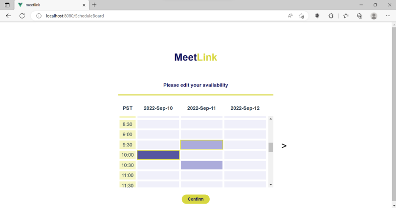

# MeetLink

MeetLink is a web app for teams to pick the best meeting date and time where majority of team members can attend

<ul>
  <li>Front-end interface is implemented with VueJS.</li>
  <li>Back-end is built with ExpressJS with a database in PostgreSQL.</li>
  <li>External RestAPIs to support validating and sending email</li>
</ul>
 

 

 

If user choose to create new planner, they will be told to pick meeting dates and given a MeetLink ID for their teams

 

If user choose to edit their availabilty on an existing schedule, they will be asked to provide their team's MeetLink ID

 

 

